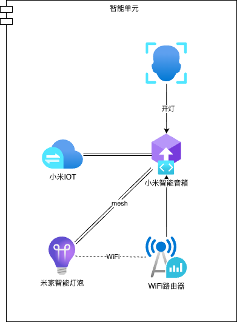
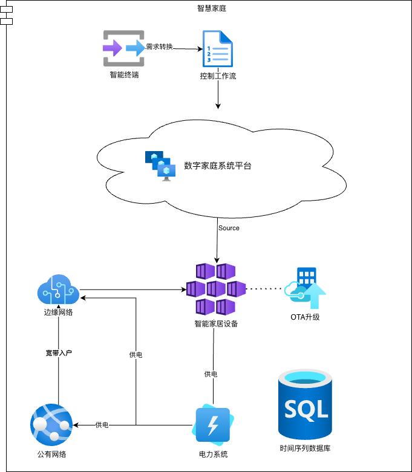

# Smart Community Architecture Design Solution

2025-10-19

## Introduction

A smart community should be a platform-independent universal standard, built upon the Internet of Everything protocol, forming a (de)centralized hybrid computing network.

The development of technology is not to enslave everything, but to enable every member to live with dignity and equality.

## Example

Here, we use Mijia (Xiaomi, please sponsor us) as an example to illustrate the minimal case of a smart home.

```LLM
Zeusro: Xiao Ai.
Xiao Ai: Yes.
Zeusro: Turn on the light.
Xiao Ai: Sure.
```

As shown above, with the support of the IoT platform behind the Xiaomi smart speaker, basic human language is converted into machine language, and finally executed on the smart light bulb.



This LLM process is essentially a statistical learning mapping, "translating" human language into other languages (or task mappings).

## Concepts

### IoT

The Internet of Things (IoT) is a system of interrelated computing devices, mechanical and digital machines, each with a universally unique identifier (UUID), and the ability to transfer data over a network without requiring human-to-human or human-to-computer interaction.

### Smart Community

A smart community refers to the integrated application of new-generation information technologies such as IoT, cloud computing, and mobile internet, providing residents with a safe, comfortable, and convenient modern intelligent living environment. It forms a new type of community management based on informatization and intelligent social management and services.

### Large Language Model

Large Language Model, abbreviated as LLM.

### Intelligent Unit

An intelligent unit is the general form of the smallest smart home network.
In the light switch example above, you can even remove the bulb and just let the Xiaomi speaker play music, forming an even smaller intelligent unit.

However, as of now (2025), smart terminals and (de)centralized networks are fundamental components that cannot be avoided.

### Centralized Network

### Decentralized Network

Also called edge networks. In the context of digital homes, it can be simply understood as the home wireless network (which connects to the centralized network and includes a local area network).

### Smart Terminal

A smart terminal is the entry point for triggering device scheduling commands. For example, smart speakers (Xiaomi Speaker, Tmall Genie, Apple HomePod, etc.), (Android/Apple) smartphones, smart wristbands, and so on.

These smart terminals can effectively receive user commands and, through remote LLM or local input parsing, convert them into general basic commands.

### Voice Assistant

A voice assistant refers to software based on LLM, or the "soul" that "inhabits" smart terminals. Examples include Alexa, Tmall Genie, Xiao Ai, etc.

### Digital Home

Based on residential spaces, the digital home leverages IoT, cloud computing, big data, mobile communications, artificial intelligence, and other new-generation information technologies to realize interconnection and interoperability of system platforms and home products, meeting users' needs for information access and digital home life services.

### Digital Home System Platform

Through information sharing and interoperability among various internal and external devices in the home, as well as functions such as data integration and application integration, the platform provides residents with comprehensive services including government, social, and smart home services in a safe and convenient manner.

### Smart Home Device

A home device with network communication capabilities that can self-describe, publish, and interact with other nodes.
[GB/T 34043-2017, Definition 3.2]

### Smart Central Control Gateway

Connects smart home devices with external networks and digital home system platforms. It is capable of information collection, processing and analysis, protocol conversion, etc., enabling information sharing and interoperability among various devices inside and outside the home, and supports devices with multiple interaction methods. This includes standalone smart gateways or integrated devices merged with video intercom indoor units, home routers, smart speakers, etc.

### Digital Home Service Provider

Entities or organizations that provide products, platforms, or services related to digital homes.

### Smart Panel

A control panel with communication capabilities. The controlled devices may include lighting, air conditioning, or other devices or appliances.

### Room

Spaces within residential buildings where people spend extended periods, including living rooms, bedrooms, studies, etc.

## Overall Architecture Design Approach

Architectural design isn't about building something from scratch, nor is it about showmanship. Rather, it's about effectively organizing and continuously optimizing resources based on actual circumstances.



Thus, during the architectural design phase, the focus isn't on simply adopting the latest technology as much as possible.

Rather, we should first clarify concepts, organize and summarize them, and establish conceptual definitions through formal logic to prepare for subsequent iterations and upgrades.

## Hardware standards

Hardware standards are subject to specific local laws and regulations.

In addition to complying with these guidelines, smart home development must also comply with current national standards and regulations.

For example, products manufactured and sold in mainland China:

1. GB 55019 建筑与市政工程无障碍通用规范
1. GB/T 26572 电子电气产品中限用物质的限量要求
1. GB/T 28827.1 信息技术服务 运行维护 第1部分：通用要求
1. GB/T 30246-3 家庭网络内部网关规范
1. GB/T 34043 物联网智能家居 图形符号
1. GB/T 34068 物联网总体技术 智能传感器接口规范
1. GB/T 35136 智能家居自动控制设备通用技术要求
1. GB/T 35273 信息安全技术 个人信息安全规范
1. GB/T 36478 （所有部分）物联网信息交换和共享
1. GB/T 37142 住宅用综合信息箱技术要求
1. GB/T 39190 物联网智能家居 设计内容及要求
1. GB/T 41387 信息安全技术 智能家居通用安全规范
1. GB/Z 28828 信息安全技术 公共及商用服务信息系统个人信息保护指南
1. GA 374 电子防盗锁
1. DB 44/T 2671 数字家庭建设评价标准
1. SJG 127 居住建筑全屋智能工程技术标准
1. T/ZSPH 15 数字家庭建设评价标准
1. GB/T 22239 信息安全技术 网络安全等级保护基本要求
1. GB/T 28450 信息技术安全技术 信息安全管理体系审核指南
1. GB/T 29245 信息安全技术 政府部门信息安全管理基本要求
1. GB/Z 29830 信息技术 安全技术 信息技术安全保障框架
1. GB/T 36626 信息安全技术 信息系统安全运维管理指南
1. GB/T 36951 信息安全技术 物联网感知终端应用安全技术要求
1. GB/T 37025 信息安全技术 物联网数据传输安全技术要求
1. GB 50311 综合布线系统工程设计规范
1. GB/T 50312 综合布线系统工程验收规范
1. GB 50174 数据中心设计规范
1. GB 50348 民用建筑电气设计标准
1. GB 50846 住宅区和住宅建筑内光纤到户通信设施工程设计规范

## Software Standards

Software standards are specialized in accordance with local laws and regulations.

1. 中华人民共和国网络安全法
1. 中华人民共和国数据安全法
1. 中华人民共和国个人信息保护法
1. 消费者权益保护法
1. 医疗器械监督管理条例
1. 医疗机构病历管理规定
1. 广东省物业管理条例
1. 广州市物业管理条例（2024 修正）

Taking the laws of mainland China as an example, the <中华人民共和国网络安全法> and the <中华人民共和国数据安全法> are high-level laws that must be complied with by any Internet platform sold and operated in mainland China.

## Protocol Fallback

Protocol fallback refers to a fault-tolerance mechanism implemented by smart homes when underlying dependent components are unavailable or the target user is mismatched.

For example, if a public cloud smart home system platform fails, can smart home devices be downgraded to a local area network solution or mesh technology for offline device control?

If elderly users are unfamiliar with the operating procedures of smart devices like smart speakers, they can still operate the target device through traditional physical control methods (such as switch panels and remote controls).

## References

[1] 
Guangzhou Municipal Housing and Urban-Rural Development Bureau: Public Consultation on "Evaluation Guidelines for Smart Home in Residential Buildings (Draft for Comments)" and "Digital Home Construction Guidelines (Draft for Comments)"
https://www.gz.gov.cn/hdjlpt/yjzj/answer/46390

[2] 
Guangzhou Digital Home Construction Guidelines (Draft for Comments)
https://www.gz.gov.cn/hdjlpt/yjzj/answer/46390

[3] 
Internet of Things – Wikipedia
https://zh.wikipedia.org/zh-hs/物联网

[4]
小米IoT开发者平台文档
https://iot.mi.com/v2/new/doc/home

[5]
设备接入服务
https://support.huaweicloud.com/iothub/index.html

[6]
home-assistant
https://github.com/home-assistant/core