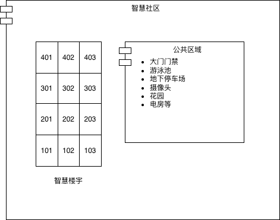

# 智能社区架构设计方案

2025-10-19

## 介绍

当前世界智能社区的问题，主要是厂商各自为政，闭门造车（不开放auth协议），对智能家庭系统平台重复建设而形成的信息孤岛。

智能社区应该是一种平台无关的通用标准，基于万物互联协议而构筑的（去）中心化混合计算网络。

科技的发展是让每一个成员能够带着尊严平等地活下去。

## 例子

这里以米家（小米快打钱）作为例子，列举智能家居的最小例子。

```LLM
卢本伟：小爱同学。
小爱同学：诶。
卢本伟：开灯。
小爱同学：好啊。
```

可以看到，经过小米智能音箱背后的IoT平台支持，基本的人类语言转成机械语言，最后在智能灯泡上体现。


这个LLM过程，相当于一种基于统计的学习映射，将人类语言“翻译”为其他语言（或任务映射）。

## 概念

### IoT

物联网（英语：Internet of Things，简称IoT）是一种计算设备、机械、数字机器相互关系的系统，具备通用唯一识别码（UUID），并具有通过网络传输数据的能力，无需人与人、或是人与设备的交互。

### 智能社区

智能社区是指充分利用物联网、云计算、移动互联网等新一代信息技术的集成应用,为社区居民提供一个安全、舒适、便利的现代化、智能化生活环境,从而形成基于信息化、智能化社会管理与服务的一种新的管理形态的社区。



### 大语言模型

大语言模型，简称LLM。

### 智能单元

智能单元是构成最小智能家居网络的一般形式。
在上面提到的开灯例子中，甚至可以把灯泡去掉，只让小米音箱播放音乐，从而构成一个更小的智能单元。

但就现阶段（2025）而言，智能终端、（去）中心化网络基本是避不开的构成要素。

### 中心化网络

当前基于根域名服务器构筑的全球网络体系。

### 去中心化网络

也叫边缘网络。在智能家庭这个概念中，可以简单理解为家庭无线网络（对接中心化网络，并且附带一个局域网络）。

### 智能终端

智能终端是触发设备调度指令的入口。比如智能音箱（小米音箱，天猫精灵，苹果HomePod等），（Android/苹果）手机，智能手环等。

这些智能终端能够有效接受用户的指令，并将指令通过远程LLM/本地输入解析，转换为一般基本命令。

### 语音助理

语音助理指的是基于LLM的软件，或者说“寄宿”在智能终端中的“灵魂”。比如Alexa、天猫精灵、小爱同学等。

### 智能家庭

以居住建筑为平台，融合建筑电气、网络通信、智能家居设备、服务平台，集系统、
服务、管理为一体的舒适、便捷、安全、高效、环保的居住环境。

### 智能家庭系统平台

通过家庭内外部各种设备之间的信息共享和互操作，以及数据集成、应用集成等功能，为居民
安全便利地提供政务服务、社会化服务和家居智能化服务的综合性系统。

智能家庭系统平台按照类型，可以分为公有云和私有云两种。

公有云智能家庭系统平台表示该平台运行在阿里云、腾讯云、AWS等公有云网络。

私有云智能家庭系统平台表示该平台运行在自有数据中心、或由第三方服务商在专用环境托管，具备高安全性，支持企业合规、数据主权等要求

### 智能家居设备

具有网络通信功能，可自描述、发布并能与其他节点进行交互操作的家居设备。

智能家居设备还可以细化为智能家电、智能面板等。

智能家电：将物联网技术、微处理器、传感器技术、网络通信技术等引入家用电器
设备后形成的智能家电产品，具有智能识别、使用或控制管理功能且可以和控制面板、
触摸屏、遥控器、移动 APP 等智能交互的设备。

智能面板：具有通信功能的控制面板，控制的设备可包括照明、空调或其他设备或电器等。

### 智能中控网关

连接智能家居设备与外部网络、智能家庭系统平台，具备信息采集、处理和分析以及协议转换
等能力，实现家庭内外部各种设备之间的信息共享和互操作，支持多种交互方式的设备。包括独立
式的智能中控网关，或者与可视对讲室内机、家庭路由器、智能音箱等其他设备融合的集成式设备。

### 智能家庭服务方

提供智能家庭相关产品、平台或服务的实体或机构。

### 智能房间

居住建筑内人员长时间活动的空间，包括起居室、卧室、书房等。

## 整体架构设计思路

架构设计不是从0到1，也不是炫技，而是根据实际情况，对资源的有效组织与持续优化。
因此，在架构设计阶段，考虑的问题点并不是尽可能地沿用最新科技。


而是通过形式逻辑，先理清概念，整理归纳，建立概念定义，为后续的迭代升级做准备。

## 硬件标准

硬件标准按照当地法律法规特殊化处理。

智能家庭建设除应符合本指引的规定外，尚应符合国家现行有关标准、规范的规定。

以中国大陆生产销售的产品为例：

1. GB 55019 建筑与市政工程无障碍通用规范
1. GB/T 26572 电子电气产品中限用物质的限量要求
1. GB/T 28827.1 信息技术服务 运行维护 第1部分：通用要求
1. GB/T 30246-3 家庭网络内部网关规范
1. GB/T 34043 物联网智能家居 图形符号
1. GB/T 34068 物联网总体技术 智能传感器接口规范
1. GB/T 35136 智能家居自动控制设备通用技术要求
1. GB/T 35273 信息安全技术 个人信息安全规范
1. GB/T 36478 （所有部分）物联网信息交换和共享
1. GB/T 37142 住宅用综合信息箱技术要求
1. GB/T 39190 物联网智能家居 设计内容及要求
1. GB/T 41387 信息安全技术 智能家居通用安全规范
1. GB/Z 28828 信息安全技术 公共及商用服务信息系统个人信息保护指南
1. GA 374 电子防盗锁
1. DB 44/T 2671 数字家庭建设评价标准
1. SJG 127 居住建筑全屋智能工程技术标准
1. T/ZSPH 15 数字家庭建设评价标准
1. GB/T 22239 信息安全技术 网络安全等级保护基本要求
1. GB/T 28450 信息技术安全技术 信息安全管理体系审核指南
1. GB/T 29245 信息安全技术 政府部门信息安全管理基本要求
1. GB/Z 29830 信息技术 安全技术 信息技术安全保障框架
1. GB/T 36626 信息安全技术 信息系统安全运维管理指南
1. GB/T 36951 信息安全技术 物联网感知终端应用安全技术要求
1. GB/T 37025 信息安全技术 物联网数据传输安全技术要求
1. GB 50311 综合布线系统工程设计规范
1. GB/T 50312 综合布线系统工程验收规范
1. GB 50174 数据中心设计规范
1. GB 50348 民用建筑电气设计标准
1. GB 50846 住宅区和住宅建筑内光纤到户通信设施工程设计规范

## 软件标准

软件标准按照当地法律法规特殊化处理。

1. 中华人民共和国网络安全法
1. 中华人民共和国数据安全法
1. 中华人民共和国个人信息保护法
1. 消费者权益保护法
1. 医疗器械监督管理条例
1. 医疗机构病历管理规定
1. 广东省物业管理条例
1. 广州市物业管理条例（2024 修正）

以中国大陆法律为例，《中华人民共和国网络安全法》和《中华人民共和国数据安全法》是高级别法律，任何在中国大陆销售、运行的互联网平台都必须强制遵守。

## 协议回退

协议回退指的是当底层依赖组件不可用，或者目标用户不匹配时，智能家居采取的一种容错机制。

以公有云智能家庭系统平台瘫痪为例，假设公有网络不可用，智能家居设备是否能够降级为局域网方案，或者mesh技术、红外线实现离线控制设备;

若老年用户不熟悉智能音箱等智能设备的操作流程，他们仍可通过传统的物理控制方式（如开关面板、遥控器）来操作目标设备。

## 参考文献

[1] 
广州市住房和城乡建设局关于公开征求《广州市居住建筑智能家居评价指引（征求意见稿）》、《广州市智能家庭建设指引（征求意见稿）》意见的公告
https://www.gz.gov.cn/hdjlpt/yjzj/answer/46390

[2] 
广州市智能家庭建设指引（征求意见稿）
https://www.gz.gov.cn/hdjlpt/yjzj/answer/46390  

[3] 
物联网 – 维基百科
https://zh.wikipedia.org/zh-hs/物联网 

[4]
小米IoT开发者平台文档
https://iot.mi.com/v2/new/doc/home

[5]
设备接入服务
https://support.huaweicloud.com/iothub/index.html

[6]
home-assistant
https://github.com/home-assistant/core